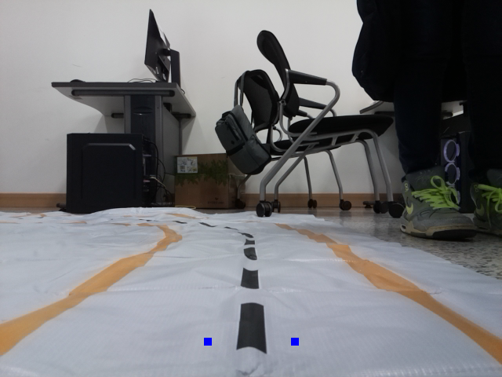

# RAPA PROJECT 3rd
## 주제 : 길 따라가는 터틀봇

팀 구성 |               
--서현호   

Purpose |               
--이탈없이 길을 잘 따라가는 터틀봇 구현  

SEO HYEON HO |          
--구상, 개발, 발표  

Risks | 좌절과 절망  

Scope, Timescales, |    
--개발 범위, 이유  

주제를 위한 해결과제 |   
--이미지의 경우의 수를 열거하고 정확한 범위 선정하기   
--그럼에도 벗어나는 경우에 대해 이유 파악하기   

[thist text](./project_desc/README.md)

## 풀어야 할 과제  
  
  
  

# 검출 영역 나누기  
## 좌, 우 2개 검출 포인트  
  

## 상,하,좌,우 10개 검출 포인트  
  
  

## 상,하,좌,우 80개 검출 포인트  
  

## 이미지 하단부 9개 ~ 12개 분할 영역  
  

## 영역 나누고 명령이 제대로 먹는지 테스트하기  
  

## 예측결과 : 전진  /  실행결과 : 좌회전  
  

## 읽어온 이미지가 도립상인지 확인하기  
  
 
 

# 검출 영역을 어떻게 읽을 것인가  
  
▶ 해당 검출 영역의 모든 픽셀값이 70 이하  

▶ 해당 검출 영역의 픽셀값 평균이 70 이하  

▶ 픽셀의 평균값이 제일 작은 영역  

▶ 픽셀의 분산값이 큰 영역  

▶ 픽셀값을 오름차순 정렬하여 상위 50개 평균값의 최소값  

# 주행 알고리즘 구현  

▶  중앙,좌,우 경우의 수를 나눠서 제어를 따로 구현  

▶  리스트로 영역을 구분하여 영역의 인덱스를 받아서 그 인덱스로 부호와 속도를 지정  

▶   영역에 따라 가중치를 부여   

